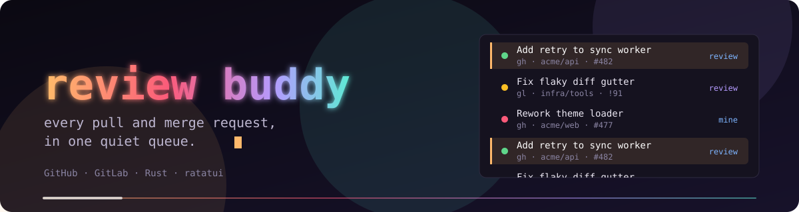

# review buddy

<p align="center">
  
</p>

Every pull and merge request, in one quiet queue. **review buddy** is a keyboard-driven terminal UI that gathers your pull requests into a single, calm dashboard, with full diff review, inline comments and approvals, without leaving the terminal. Built in Rust with `ratatui` and `crossterm`, in the [Liminal HQ](https://github.com/liminal-hq) style.

> **Status:** v0.1.0 is the first release candidate, and it is **GitHub only**. GitLab listing and detail arrive in v0.2 (diffs and reviews follow in the same release), and merging, suggestions, side-by-side diffs and the command palette follow in v0.3 and v0.4. See [What's in 0.1](#whats-in-01) for the honest list, and [`CHANGELOG.md`](CHANGELOG.md) for the history.

## Highlights

- **One queue.** Your GitHub pull requests (github.com and Enterprise) bucketed by what needs you: Waiting on you, Worth a look, Can wait, and a collapsed Noise row for bots.
- **Quiet by design.** Calm copy, no alarms, pull-only refresh, and `NO_COLOR` support.
- **Review in the terminal.** A unified diff with threads, a line cursor, comments that collect into a pending review, and approval after a preview.
- **Scriptable.** A `gh`-style command line (`queue`, `pr view`, `pr diff`, `pr checks`, `--json` and `--jq`) that never opens the TUI.
- **Always explorable.** `--demo` runs against offline fixtures with no network and no credentials.
- **Your secrets stay put.** Tokens come from `gh`, the OS keyring, an `env:VAR` or a `token_command`. Never from disk.
- **Themeable.** Liminal HQ is the default look, with Dusk, Afterglow Dark and Afterglow Light built in.

## What's in 0.1

| Area | In v0.1.0 | Planned |
|---|---|---|
| Forges | GitHub, including Enterprise | GitLab merge request lists and details in v0.2; diffs and reviews to follow |
| Dashboard | The three-pane layout (sources, queue, detail) with Overview, Files, Checks and Conversation tabs | Split and one-at-a-time layouts, command palette, search, settings (v0.4) |
| Diff | Unified diff, file list, line cursor, inline threads, hunk and file jumps, syntax highlighting with tinted added and removed lines | Ranges, suggestions, side by side, merge, re-run CI, checkout (v0.3) |
| Review | Line comments that collect into a pending review, replies, approve with a preview, open and copy the URL | Request changes (v0.3), draft persistence (1.0) |
| Mouse | Click, double-click, drag a range, wheel, tabs and chips. Shift always falls through to the terminal | |
| Command line | `queue`, `pr list`, `pr view`, `pr diff`, `pr checks`, `pr open`, `open`, `auth status`, `source list`, `config paths`, `theme list`, `doctor`, `completion`, with `--json` and `--jq` | `auth login`, `source add`, `config get` (v0.2); writes (v0.3) |
| Demo | `--demo` with frozen time and scenes, writes labelled `(demo)` | |
| Themes | Four built-ins, `NO_COLOR`, colour-depth detection | User theme files (v0.4) |
| Install | `install.sh`, `install.ps1`, archives, `.deb` and `.rpm`, shell completions and a man page | Homebrew, Scoop and friends are not planned yet |

## Quick start

Try it with no network and no credentials:

```bash
review-buddy --demo
```

The terminal needs to be at least 100×30. Press `?` for the keys on the current screen, `⏎` to open a diff, `q` to quit. Nothing in demo mode touches your config, cache or tokens.

### First run

When you're ready to use your own accounts, just run `review-buddy`. With no config file it opens a calm first-run screen that finds the hosts you already use (from `gh` and `glab` sign-ins, your `~/.gitconfig` `insteadOf` rewrites and repositories under `~/src`), lists your accounts and organisations, lets you reuse a CLI sign-in or paste a token (tested live, then kept in your OS keyring and never in `config.toml`), previews a theme, and writes a commented `config.toml` only when you confirm. Press `esc` to skip it. Run `review-buddy --setup` any time to go through it again (an existing file is replaced only if you say yes, and a copy is kept as `config.toml.bak`), or `review-buddy --setup --plain` for a line-based version that also runs when there's no terminal to draw in.

You can still write the config by hand: copy [`config.example.toml`](config.example.toml) to `~/.config/review-buddy/config.toml` (or `$XDG_CONFIG_HOME/review-buddy/config.toml`). GitLab sources list their merge requests and open details; diffs and reviews on GitLab arrive later in v0.2. `review-buddy doctor` checks sign-in, rate limits and the paths in use.

### Command line

With no command, `review-buddy` opens the TUI. With a command it is non-interactive and pipe-friendly, like `gh`. The examples below run on the demo fixtures, so you can try them verbatim; drop `--demo` and `--frozen-time` to use your own sources.

```bash
review-buddy --demo --frozen-time 2026-10-05T10:00 queue
review-buddy --demo --frozen-time 2026-10-05T10:00 -s liminal-hq -R liminal-hq/review-buddy pr view 214
review-buddy --demo --frozen-time 2026-10-05T10:00 -s liminal-hq -R liminal-hq/review-buddy pr diff 214 --stat
review-buddy --demo --frozen-time 2026-10-05T10:00 -s liminal-hq -R liminal-hq/review-buddy pr checks 214
review-buddy --demo auth status
review-buddy --demo doctor
```

Without `--demo`, a number needs `--repo`, or a git clone whose remote matches one of your sources (`review-buddy pr view 214`).

Piped output is stable, tab-separated and uncoloured. `queue` prints `bucket  source  ref  ci  author  updatedAt  title`:

```text
$ review-buddy --demo --frozen-time 2026-10-05T10:00 queue
wait	liminal-hq	liminal-hq/review-buddy#214	running	ada	2026-10-05T08:00:00Z	Add a menu bar and keyboard-driven menus
wait	liminal-hq	liminal-hq/review-buddy#209	pass	jo	2026-10-05T05:00:00Z	Raise muted text contrast in the light theme
look	platform	platform/flow!1182	fail	priya	2026-10-05T03:00:00Z	Cache pipeline status lookups
look	smorris	smorris/dotfiles#31	pass	smorris	2026-10-04T10:00:00Z	Tidy zsh startup
later	gitlab-com	kai-codes/notes!12	none	kai	2026-10-02T10:00:00Z	Clarify the install steps
```

`pr view` summarises one change:

```text
$ review-buddy --demo --frozen-time 2026-10-05T10:00 -s liminal-hq -R liminal-hq/review-buddy pr view 214
Add a menu bar and keyboard-driven menus
liminal-hq/review-buddy#214 · open
ada wants ada/menus → main
+32 −1 · 3 files · opened 3d ago

Bucket    Waiting on you · your review is requested
Reviewers smorris (requested), jo (commented)
Checks    1 running · 2 passing
...
```

`pr diff` prints the patch (`--stat` and `--name-only` summarise it), and `pr checks` exits `0` when everything passed, `1` when something failed and `8` while checks are still running:

```text
$ review-buddy --demo --frozen-time 2026-10-05T10:00 -s liminal-hq -R liminal-hq/review-buddy pr diff 214 --stat
 src/ui/menus.rs   |  23 ++++++++++++++++++++++-
 src/ui/menubar.rs |   8 ++++++++
 src/ui/mod.rs     |   2 ++
 3 files changed, 32 insertions(+), 1 deletion(-)
```

Add `--json <fields>` for scripts (with no fields it lists the ones available), and `--jq <expr>` to filter with a built-in jq, so you don't need the `jq` binary:

```text
$ review-buddy --demo --frozen-time 2026-10-05T10:00 queue --json number,title --jq '.[0]'
{"number":214,"title":"Add a menu bar and keyboard-driven menus"}

$ review-buddy --demo --frozen-time 2026-10-05T10:00 queue --json ref,ci --jq '[.[]|select(.ci=="fail")|.ref]'
["platform/flow!1182"]

$ review-buddy --demo --frozen-time 2026-10-05T10:00 auth status --jq '.[0].user'
smorris
```

`review-buddy --help` lists everything, and `docs/cli.md` has the selectors, output rules and exit codes. Commands that aren't built yet exit `2` and say which milestone they're planned for.

### Keys

| Key | Where | Does |
|---|---|---|
| `j` `k` / `↑` `↓` | Everywhere | Move |
| `g` `G` | Everywhere | First / last row or line |
| `tab` `h` `l` | Dashboard | Next / previous pane |
| `1`–`9` | Dashboard | Switch source |
| `[` `]` | Dashboard | Previous / next detail tab |
| `⏎` or `d` | Dashboard | Open the diff |
| `r` | Dashboard | Refresh now |
| `n` `p` | Diff | Next / previous hunk |
| `]` `[` | Diff | Next / previous file |
| `tab` | Diff | Switch between files and diff |
| `c` / `r` | Diff | Comment on the line / reply to the thread |
| `a` | Diff | Approve, after a preview |
| `o` / `y` | Everywhere | Open in the browser / copy the URL |
| `T` | Everywhere | Cycle theme |
| `?` | Everywhere | Help for the current screen |
| `esc` / `q` | Diff / dashboard | Back / quit |

The full keymap, including what is planned, is in [`docs/keybindings.md`](docs/keybindings.md).

### A frame from the demo

Screenshots and recordings aren't checked in as binary files. This is one real frame, captured from `review-buddy --demo --frozen-time 2026-10-05T10:00` in a 130×30 terminal, and the snapshots under `crates/review-buddy/tests/snapshots/` pin the canonical frames in every theme.

<details>
<summary>Three-pane dashboard (demo)</summary>

```text
 review buddy  ·  demo · 4 sources · 7 changes                                                                         Liminal HQ
╭ sources ───────────────╮╭ queue ───────────────────────────────────────╮╭ liminal-hq/review-buddy#214 ─────────────────────────╮
│▌ ● All               7 ││  Waiting on you · 2                          ││ Add a menu bar and keyboard-driven menus             │
│    every source        ││▌ ◐ Add a menu bar and keyboard-driven me… 2h ││ ada wants ada/menus → main                           │
│  ● liminal-hq        3 ││▌ GH review-buddy#214 · ada · review requested││ +32 −1 · 3 files · opened 3d ago                     │
│    github.com          ││  ● Raise muted text contrast in the ligh… 5h ││                                                      │
│  ● smorris           1 ││  GH review-buddy#209 · jo · approved by you  ││ a Approve  x Request changes  c Comment  ⏎ Diff      │
│    github.com          ││                                              ││                                                      │
│  ● platform          2 ││  Worth a look · 2                            ││  Overview   Files 3   Checks 6   Conversation 3      │
│    gitlab.platform.ex… ││  ✕ Cache pipeline status lookups          7h ││ ──────────────────────────────────────────────────── │
│  ● gitlab.com        1 ││  GL flow!1182 · priya · you're mentioned     ││ Adds a menu bar along the top and a Menu type that   │
│    gitlab.com          ││  ● Tidy zsh startup                       1d ││ tracks the selected item.                            │
│                        ││  GH dotfiles#31 · smorris · yours            ││                                                      │
│                        ││                                              ││ • Menu::select_next and Menu::select_prev move the   │
│                        ││  Can wait · 1                                ││ highlight                                            │
│                        ││  · Clarify the install steps              3d ││ • Menu::activate returns the action for the          │
│                        ││  GL notes!12 · kai · approved by you         ││ highlighted item                                     │
│                        ││                                              ││ • The bar itself is a plain Line, so it picks up the │
│                        ││  ▸ Noise · 2 bot updates · ⏎ to expand       ││ …                                                    │
│                        ││                                              ││                                                      │
│                        ││  ── That's everything.                       ││ Reviewers                                            │
│                        ││  7 in this view.                             ││ ◌ smorris requested                                  │
│                        ││                                              ││ ✎ jo commented                                       │
│                        ││                                              ││                                                      │
│                        ││                                              ││ Checks                                               │
│                        ││                                              ││ ● 2 passing  ◐ 1 running                             │
│                        ││                                              ││ ○ 1 neutral  ↷ 1 skipped  ⊘ 1 cancelled              │
│                        ││                                              ││                                                      │
╰────────────────────────╯╰──────────────────────────────────────────────╯╰──────────────────────────────────────────────────────╯
 ⏎ diff  o open  y copy  ? help  T theme  q quit
```

</details>

## Install

Linux and macOS:

```bash
curl -fsSL https://raw.githubusercontent.com/smorrisods/review-buddy/main/scripts/install.sh | sh
```

The installer picks the static musl build on Linux (amd64 or arm64) and the universal binary on macOS, verifies the download against `SHA256SUMS`, and refuses on a mismatch. It installs into `/usr/local` when that is writable, and otherwise into `~/.local` with a note; it never runs `sudo` for you, and prints the command instead. The man page, bundled themes and shell completions go alongside the binary. Options go after `sh -s --`:

```bash
curl -fsSL https://raw.githubusercontent.com/smorrisods/review-buddy/main/scripts/install.sh | sh -s -- --dry-run
curl -fsSL https://raw.githubusercontent.com/smorrisods/review-buddy/main/scripts/install.sh | sh -s -- --version v0.1.0 --prefix "$HOME/.local"
curl -fsSL https://raw.githubusercontent.com/smorrisods/review-buddy/main/scripts/install.sh | sh -s -- --uninstall
```

Windows (PowerShell 5.1 or 7):

```powershell
irm https://raw.githubusercontent.com/smorrisods/review-buddy/main/scripts/install.ps1 | iex
```

It installs to `%LOCALAPPDATA%\Programs\review-buddy`, verifies `SHA256SUMS`, and offers to add that folder to your user `PATH`. Download `install.ps1` first if you want `-Version`, `-InstallDir`, `-DryRun`, `-Yes` or `-Uninstall`.

By hand: download an archive and `SHA256SUMS` from the [releases page](https://github.com/smorrisods/review-buddy/releases), check it with `sha256sum -c SHA256SUMS --ignore-missing`, and unpack it into a prefix. Debian and Ubuntu users can install the `.deb`, and Fedora and RHEL users the `.rpm` (glibc 2.35 or newer). The binaries are unsigned: macOS gets an ad-hoc signature only, and Windows may show a SmartScreen prompt for browser downloads. `docs/release.md` covers both.

To build from source you need Rust 1.87 or newer:

```bash
cargo build --release          # target/release/review-buddy
cargo build --no-default-features   # no demo fixtures, no network
```

## Configuration

Config lives at `$XDG_CONFIG_HOME/review-buddy/config.toml` (default `~/.config/review-buddy/`, on macOS too, and `%APPDATA%\review-buddy\` on Windows). Start from [`config.example.toml`](config.example.toml), which is complete and commented. Not every option is applied in 0.1; `docs/configuration.md` marks which ones are.

## Documentation

- [`docs/SPEC.md`](docs/SPEC.md): the product spec, with the release plan
- [`docs/cli.md`](docs/cli.md): the command line, selectors, output and exit codes
- [`docs/architecture.md`](docs/architecture.md): workspace layout and the provider trait
- [`docs/configuration.md`](docs/configuration.md): config files, environment variables, and the command line
- [`docs/keybindings.md`](docs/keybindings.md): the keymap
- [`docs/theming.md`](docs/theming.md): themes and roles
- [`docs/integrations.md`](docs/integrations.md): forge APIs and auth
- [`docs/release.md`](docs/release.md): targets and the release process
- [`docs/testing.md`](docs/testing.md): running tests and reviewing snapshots
- [`CHANGELOG.md`](CHANGELOG.md): what changed in each release

## Contributing

Read `AGENTS.md` for conventions: Conventional Commits, branch prefixes, merge-commit-only PRs, and Canadian English. Enable the pre-push hook with `git config core.hooksPath scripts/hooks`. Run `cargo test --workspace` before you push, and see [`docs/testing.md`](docs/testing.md) for how the frame snapshots work and how to review them with `cargo insta review`. Tests use demo mode and recorded fixtures only; live write tests run against throwaway repositories, never a real project.

## Licence

MIT. See [`LICENSE`](LICENSE).
